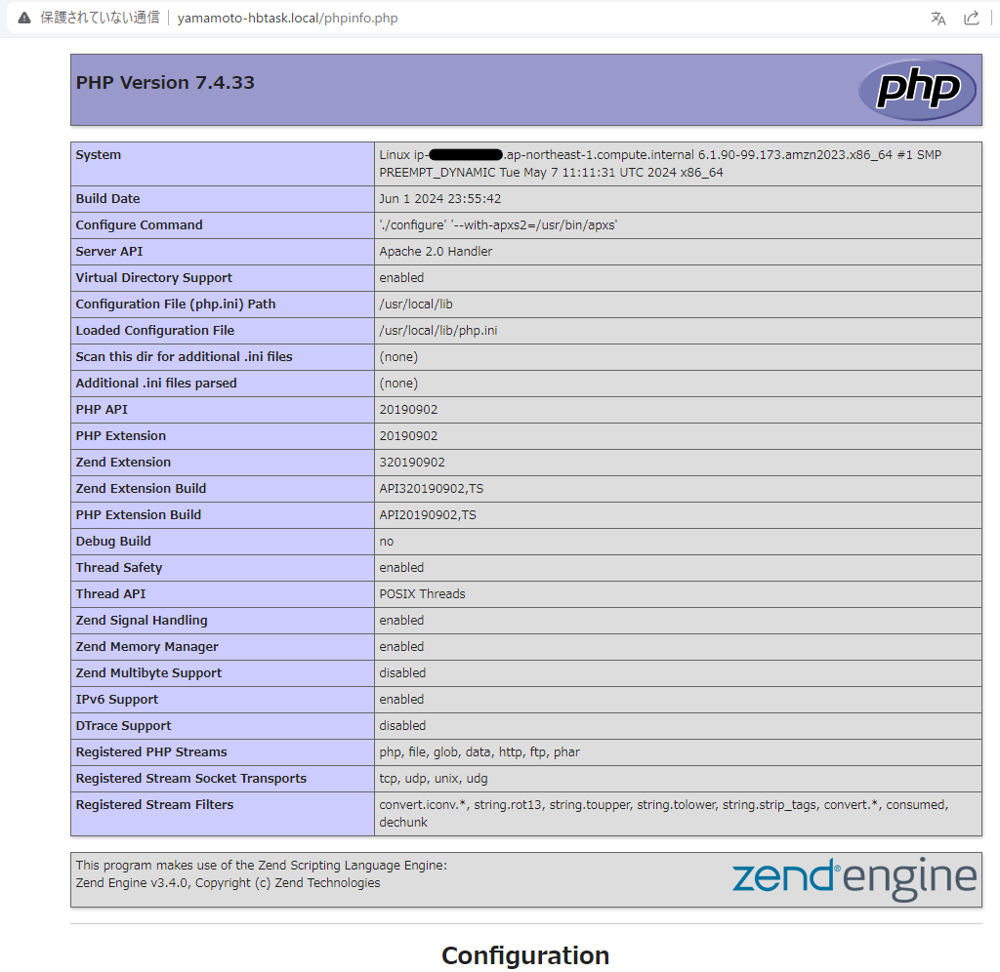

# LAMP環境構築

|ソース|説明|
|:---:|---|
|[Linux](https://www.linux.org/threads/what-is-linux.4106/)|Linus Torvaldsがヘルシンキ大学の学生時代に作ったカーネルから発展したオペレーティング・システム|
|[Apache](https://cwiki.apache.org/confluence/display/httpd/FAQ#FAQ-WhatisApache?)|強力で柔軟なHTTP/1.1準拠のウェブサーバ|
|[MySQL](https://www.oracle.com/mysql/what-is-mysql/)|世界で最も普及しているオープンソース・データベース|
|[PHP](https://www.php.net/manual/en/intro-whatis.php)|オープンソースの汎用スクリプト言語。Web開発に適しており、HTMLに埋め込むことができる|

<br>
<br>

## Linux
- サーバ環境：AWS ( EC2 )
- OS：[Amazon Linux 2023](https://aws.amazon.com/mp/linux/?nc1=h_ls)

<br>

#### 1. VPCとEC2の作成
- 今回は冗長化は意識せず、単純な構成で作成することにした

  
  

<br>

#### 2. EC2へSSH接続をする


- EC2のセキュリティーグループで、MyIPアドレスからしかSSH接続できないように設定していたが、リモート接続が失敗となるため、再度MyIPアドレスを確認したところ、設定しているMyIPアドレスに誤りがあることがわかった
- 設定を修正し、無事SSH接続に成功した

  

```sh
# OSパッケージのアップデート
sudo dnf update
```

<br>

#### 3. サーバのタイムゾーンをUTCからJSTに変更
〈参考サイト〉
- [Documentation: Set the time for your Linux instance](https://docs.aws.amazon.com/AWSEC2/latest/UserGuide/set-time.html)
- [Product Documentation: Chapter 3. Configuring the Date and Time](https://access.redhat.com/documentation/en-us/red_hat_enterprise_linux/7/html/system_administrators_guide/chap-configuring_the_date_and_time)

```sh
# コマンドについて調べる
man timedatectl

# 現在のタイムゾーンの設定を表示
timedatectl

# 使用可能なタイムゾーンを一覧表示
timedatectl list-timezones

# 選択したタイムゾーンを設定
sudo timedatectl set-timezone Asia/Tokyo
```


<br>

#### 4. NTPサーバとの時刻同期
〈参考サイト〉
- [NTPサーバとは？時刻同期の設定はどうすればいいの？](https://hnavi.co.jp/knowledge/blog/ntp-server/)
- [AWS News Blog: Keeping Time With Amazon Time Sync Service](https://aws.amazon.com/jp/blogs/aws/keeping-time-with-amazon-time-sync-service/)
- [【AmazonLinux2023】NTP（Chrony）とタイムゾーンの設定](https://qiita.com/NMRchan/items/883296b819b4182031e4)

<br>

- そもそもタイムゾーンとどういった違いがあるのかを知らなかったため、調べるところからはじめた
- 違いを調べてからAWSニュースブログを確認すると、Amazon Time Sync ServiceがNTPで配信される時刻同期サービスらしく、またAmazon Linux 2023には最初から`chronyc`がインストールされているとのことだった
- `man chronyc`を実行すると詳細が表示された
  - 試しに`man chronyd`は実行してもエラーになる
  - RHELとCentOS（Ver.6まで）では`chronyc`ではなく`chronyd`で実行するとドキュメントに記載あり
- `chronyc tracking`コマンドを実行すると、`System time`が`NTP Time`になっている
- `date`コマンドでは日本時間が表示される
- 以上から、時刻同期ができているのではないかと判断した

<br>

#### 4. SELinuxを無効に設定
〈参考サイト〉
- [Documentation: Setting SELinux modes for AL2023](https://docs.aws.amazon.com/linux/al2023/ug/selinux-modes.html)
- [GitHub: SELinux Overview](https://github.com/SELinuxProject/selinux-notebook/blob/main/src/selinux_overview.md#selinux-overview)
- [Documentation: Option to disable SELinux for AL2023](https://docs.aws.amazon.com/linux/al2023/ug/disable-option-selinux.html)
- [Product Documentation: Chapter 1. Introduction to RPM](https://access.redhat.com/documentation/en-us/red_hat_enterprise_linux/9/html/packaging_and_distributing_software/introduction-to-rpm_packaging-and-distributing-software)
- [System Design Guide: 40.4. Changing kernel command-line parameters for all boot entries](https://access.redhat.com/documentation/en-us/red_hat_enterprise_linux/8/html/system_design_guide/configuring-kernel-command-line-parameters_system-design-guide#changing-kernel-command-line-parameters-for-all-boot-entries_configuring-kernel-command-line-parameters)

```sh
# コマンドについて調べる
man rpm
man grubby

# grubbyパッケージがインストールされていることを確認
rpm -q grubby

# selinux=0をカーネルコマンドラインに追加するようにブートローダーを設定
# --update-kernel ALL ＝ すべてのカーネルの更新情報
# --args selinux=0 ＝ カーネルの引数を指定
sudo grubby --update-kernel ALL --args selinux=0

# システムを再起動
sudo reboot

# SELinuxの動作モードを表示
getenforce
```

- SELinuxが無効になっていることが確認できた

   

<br>
<br>

## Apache
〈参考サイト〉
- [APACHE HTTP SERVER PROJECT](https://httpd.apache.org/)
- [Tutorial: Install a LAMP server on AL2023](https://docs.aws.amazon.com/linux/al2023/ug/ec2-lamp-amazon-linux-2023.html)
- [Documentation: Name-based Virtual Host Support](https://httpd.apache.org/docs/2.4/en/vhosts/name-based.html)

```sh
# Apacheのインストール
sudo dnf install httpd

# Apacheウェブサーバの起動
sudo systemctl start httpd

# ステータス確認
sudo systemctl status httpd

# Apacheの自動起動設定
sudo systemctl enable httpd

# 自動起動設定の確認
sudo systemctl is-enabled httpd
```
- 自動起動設定の方法をApache公式ドキュメントから自力で見つけることができなかったため、AWSのドキュメントと`man systemctl`で表示される内容を確認した

  
  

- コマンドを実行した結果

  

- ブラウザからアクセスしてみると、「It works!」と表示される

  

<br>

- 次にVirtualHostの設定を試みた

```sh
# configファイルの作成
sudo touch /etc/httpd/conf.d/virtualhost.conf

# configファイルの設定
sudo vi /etc/httpd/conf.d/virtualhost.conf
```


```sh
# ディレクトリの作成
sudo mkdir /var/www/yamamoto
sudo mkdir /var/www/kazuha

# HTMLファイルの作成
sudo touch /var/www/yamamoto/index.html
sudo touch /var/www/kazuha/index.html

# HTMLファイルの編集
sudo vi /var/www/yamamoto/index.html
sudo vi /var/www/kazuha/index.html

# HTMLファイルの設定内容
<html><body><h1>こんにちは。ありがとう。</h1></body></html>
<html><body><h1>ありがとう。こんにちは。</h1></body></html>

# Apacheの設定を再読み込み
sudo systemctl restart httpd
```

- アクセスを試みたが、Webブラウザが表示されなかった
- 参考にした技術ブログのようにALBとRoute 53の設定が必要なのだろうかと悩んだが、ローカルPCのhostsファイルを設定することで、指定したサーバのWebサイトを表示できるようになるという別の技術ブログを見つける
- hostsファイルを設定する前にconfigファイルが名前ベースのバーチャルホストになっていないことに気づき修正をした

  

***
〈参考サイト / 追加分〉
- [ALB と ACM で Apache の Virtual Host 構成をためしてみた](https://qiita.com/sugimount-a/items/7e5ebd390cb59c3e55da)
- [Apache 名前ベースのバーチャルホストの設定 【実用編】](https://dennie.tokyo/it/?p=2386#hosts)
- [[共通] hostsファイルの編集（WindowsOSのPCの場合）](https://faq.wadax.ne.jp/s/article/1345)
- [hosts設定方法(Windows10)](https://support.denet.co.jp/support/solutions/articles/67000665893-hosts%E8%A8%AD%E5%AE%9A%E6%96%B9%E6%B3%95-windows10-)
- [urlの最後の「/（スラッシュ）」あり・なしの違いは？必要性について解説](https://gmotech.jp/semlabo/seo/blog/url-slash/)
***

<br>

- 念のためhostsファイルのバックアップを行った
- ファイルの設定をするにあたり、管理者権限がなく上書き保存ができなかったため、メモ帳を管理者として実行
- メモ帳の「開く」からhostsファイルを開き、一番下に2行分追記をした

```sh
# IPアドレスとドメイン名の間には半角スペースが必須
EC2のパブリックIPアドレス yamamoto-hbtask.local
EC2のパブリックIPアドレス kazuha-hbtask.local
```

- hostsファイルを上書き保存し、Webブラウザからアクセス
```sh
# 下記URLにてアクセス
http://yamamoto-hbtask.local/
http://kazuha-hbtask.local/
```

- 無事Webサイトが表示された

  
  

<br>
<br>

## PHP
〈参考サイト〉
- [Documentation: PHP in AL2023](https://docs.aws.amazon.com/linux/al2023/ug/php.html)
- [Questions: Install php7.3 on Amazon Linux 2023 image](https://repost.aws/questions/QUA6GzAfcHTIaptkn7KQl8Hw/install-php7-3-on-amazon-linux-2023-image#ANONg9yOexQuyom0jhajVsPQ)
- [Documentation: PHP 7 ChangeLog](https://www.php.net/ChangeLog-7.php#7.4.30)

<br>

- 調べると、7系はAmazon Linux 2023ではサポートされていないとのことだった
- AWS re:PostのQuestionsにあった投稿等を参考に7系のインストールを行った

```sh
# ルート権限に一時的に移行
sudo su -

# OSパッケージのアップデート
dnf update -y

# ライブラリのインストール
# libxml2-devel：XMLファイルやHTMLファイルの読み込み、変更、書き込みをサポート
# bzip2-devel：ヘッダーファイルとbzip2関数のライブラリ
# curl-devel：ファイルを取得するためのツール
# readline-devel：コマンドラインを編集するための一連の関数を提供
# libxslt-devel：XMLファイルを他のXMLファイル（またはHTML等）に変換
# tar：複数のファイルを単一のアーカイブに格納し、操作するために設計されたプログラム
# gzip：名前付きファイルのサイズを縮小（.gz という拡張子を持つものに）
# make：自動的に判断してリコンパイルするためのコマンド
# gcc：前処理、コンパイル、アセンブル、リンクが行われる
dnf install -y tar gzip make gcc libxml2-devel bzip2-devel curl-devel readline-devel libxslt-devel

# PHPのtar.gzファイルをダウンロード
curl https://www.php.net/distributions/php-7.4.33.tar.gz -o php-7.4.33.tar.gz

# gzipで圧縮されたアーカイブを展開
tar -xzvf php-7.4.33.tar.gz

# ディレクトリの移動
cd php-7.4.33

# Makeファイルの作成
./configure --with-bz2 --enable-calendar --with-curl --enable-exif --enable-ftp --with-gettext --enable-mbstring --with-mysqli --with-mysqli=mysqlnd --with-pdo-mysql=mysqlnd  --enable-pcntl --with-pdo-mysql --disable-posix --with-readline --enable-sockets --enable-wddx --with-xmlrpc --with-xsl --with-zlib --disable-fileinfo
```

- オプションはなにが必要でなにが不必要なのかの取捨選択ができなかった
- `./configure --help`で内容を確認し、AWS re:PostのQuestionsに記載のあったものをそのまま活用した

<br>

|オプション|説明|
|:---:|---|
|--with-bz2|bzip2(.bz2)で圧縮されたファイルを透過的に読み書きできる|
|--enable-calendar|カレンダー変換サポートの有効化|
|--with-curl|多くの異なったプロトコルで様々なサーバーと接続し、通信することが可能|
|--enable-exif|EXIF（画像のメタデータ）サポートの有効化|
|--enable-ftp|File Transfer Protocolサポートの有効化|
|--with-gettext|PHP アプリケーションを国際化する際に使用することが可能|
|--enable-mbstring|マルチバイト文字列サポートの有効化|
|--with-mysqli|MySQL 4.1以上で提供される機能を利用することができるようになる|
|--with-mysqli=mysqlnd|MySQLネイティブドライバを使用|
|--with-pdo-mysql=mysqlnd|MySQLのベースディレクトリを使用|
|--enable-pcntl|プロセス制御機能の有効化（CLI/CGIのみ）|
|--with-pdo-mysql|PDO：MySQLのサポート|
|--disable-posix|POSIXライクな関数を無効化|
|--with-readline|コマンドラインの編集機能（CLI/CGIのみ）|
|--enable-sockets|ソケットサーバーとして動作させることが可能|
|--enable-wddx|**※1**|
|--with-xmlrpc|XMLRPC-EPIのサポートを含む|
|--with-xsl|XSLの標準規格を実装 **※2**|
|--with-zlib|gzip(.gz)で圧縮されたファイルを読み書きすることが可能|
|--disable-fileinfo|ファイル情報サポートの無効化|

<br>

- 上記まで進めたところでエラーが表示された

```sh
# エラー内容
checking for sqlite3 > 3.7.4... no
configure: error: Package requirements (sqlite3 > 3.7.4) ware not met:

Package 'sqlite3', required by 'virtual:world', not found
```

- `php-7.4.33`と`php-7.4.33.tar.gz`は存在しているのが確認できたため、エラーについて調べた
- エラーを翻訳したが、根本的な解決策を自力で見つけることができなかった
- エラー文を元に類似の事象がないかを調べ、下記コマンドを試した

```sh
# SQLデータベースエンジンを実装したC言語ライブラリのインストール
dnf install sqlite-devel

# 再度挑戦
./configure --with-bz2 --enable-calendar --with-curl --enable-exif --enable-ftp --with-gettext --enable-mbstring --with-mysqli --with-mysqli=mysqlnd --with-pdo-mysql=mysqlnd  --enable-pcntl --with-pdo-mysql --disable-posix --with-readline --enable-sockets --enable-wddx --with-xmlrpc --with-xsl --with-zlib --disable-fileinfo
```

- しかし今度は、`openssl`がないというエラーが表示された

```sh
# 暗号をサポートするツールキットをインストール
dnf install openssl-devel

# 追加で表示された正規表現ライブラリをインストール
dnf install oniguruma-devel
```

- 不足しているものを特定するもっと効率的な方法があったのかもしれないが、調べてもわからなかった
- 上記をインストールしてから再度`./configure`を実行すると、`Thank you for using PHP.`と表示された

```sh
# アプリのコンパイルとインストール
make && make install

# PHPのバージョン確認
php -v

# ec2-userに戻る
exit
```

- 以上で無事に指定したバージョンのPHPがインストールできた

  

<br>

- インストールが完了してから発覚したこと
  - `WDDX`はPHP 7.4.0以降では推奨されていないモジュールだとわかった（**※1**）
     - libxml拡張モジュールをインストールしていないため、機能はしていないと思われる
  - `--with-xsl`もlibxml拡張モジュールが必要（**※2**）
- Function Referenceをなかなか見つけられなかったことを反省した

<br>

***
〈参考サイト / 追加分〉
- [configure error: Package requirements (sqlite3 > 3.7.4) were not met](https://stackoverflow.com/questions/62154342/configure-error-package-requirements-sqlite3-3-7-4-were-not-met)
- [amazonlinux2023にphp8.3のインストールしたいです。](https://repost.aws/it/questions/QUxk4hK43CSFCmnTqNgOvU3Q/amazonlinux-2023-%E3%81%ABphp-8-3-%E3%81%AE%E3%82%A4%E3%83%B3%E3%82%B9%E3%83%88%E3%83%BC%E3%83%AB%E3%81%97%E3%81%9F%E3%81%84%E3%81%A7%E3%81%99%E3%80%82?sc_ichannel=ha&sc_ilang=ja&sc_isite=repost&sc_iplace=hp&sc_icontent=QUxk4hK43CSFCmnTqNgOvU3Q&sc_ipos=2)
- [PHP Manual: Alphabetical](https://www.php.net/manual/en/extensions.alphabetical.php)
- [Development Libraries](https://ftp.riken.jp/Linux/scientific/obsolete/48/i386/apt/RPMS.os/repodata/repoview/development-libs.group.html)
- [Linux Intermediate Tutorials: Installing programs and upgrading versions](https://www.linux.org/threads/installing-programs-and-upgrading-versions.4145/)
- [PHP Manual: Function Reference](https://www.php.net/manual/en/funcref.php)
- [【 tar 】コマンド――アーカイブファイルを作成する／展開する](https://atmarkit.itmedia.co.jp/ait/articles/1608/15/news015.html)
  - `man tar`でわからなかったものを確認
- [GitHub: Oniguruma](https://github.com/kkos/oniguruma/)
- [configure, make, make install とは何か](https://qiita.com/chihiro/items/f270744d7e09c58a50a5)
  - `./configure --help`をや`man`コマンドで確認したが、ぼんやりとしかわからない部分があったため
***

<br>

- `http://yamamoto-hbtask.local/phpinfo.php`でアクセスを試みたが、Webサイトが表示されなかった

  

- PHPをインストールすれば表示されると安易に考えていたが、そうではなかった模様
- PHPの公式サイトだけでは内容が理解できなかったため、技術ブログもあわせて参考にした
- 試しにAWSのチュートリアル通り、`echo "<?php phpinfo(); ?>" > /var/www/html/phpinfo.php`でファイルを作成し、パブリックDNSアドレスにスラッシュとファイル名を追加してWebブラウザからアクセスしてみたが404エラーが返された
- `phpinfo.php`ファイルを`/var/www/yamamoto/`配下に移した
- `yamamoto-hbtask.local/phpinfo.php`でアクセスしたところ、下図が表示された

  

- PHP公式サイトや、二次情報等を見ながら解決策を考える
- エラーログの確認を失念していたことに気づき、確認を行った
- ログファイルは`/etc/httpd/logs/error_log`に格納されている

  
  - エラー内容
    - /var/www/cgi-bin/luci からの標準エラー: スクリプトが見つかりません
    - /var/www/html/ ディレクトリを提供できません: 一致するDirectoryIndex (index.html) が見つからずサーバが生成したディレクトリインデックスがOptionsディレクトリブで禁止されています
- 2つのエラーログが見つかったが、MyIPアドレスがクライアントになっているエラーは上記の2つ目だけだった
  - EC2のセキュリティーグループのインバウンドルールを編集
    - 80番ポートのソースをMyIPアドレスに変更
- しかし直近のログでは`notice`のログしか残っていなかった

<br>

- Apacheをインストールした際、必要な設定の特定ができなかったため、後回しにしていたことを唐突に思い出した
- ApacheとPHPの公式サイトを見て、わからない箇所は技術ブログ等と見比べながら設定をした

```sh
# PHPの環境設定ファイルのコピー
# ini-developmentはphp-7.4.33ディレクトリの中に存在
cp php.ini-development /usr/local/lib/php.ini

# Apacheのconfigファイルの設定

# Options Indexes FollowSymLinksをコメントアウトして以下を挿入
Options FollowSymLinks

# <IfModule dir_module>に以下を追加
index.php

# <IfModule mime_module>に以下を追加
AddType application/x-httpd-php .php

# Apacheの再起動
sudo systemctl restart httpd
```

- 再起動は無事にできたが、それでもブラウザ上ではPHPの関数がそのまま表示されている
- PHP公式サイトにあるように、httpd.confを編集してPHPの共有モジュールをロードするよう設定しようと試みる

```sh
# モジュールの読み込み
LoadModule php7_module modules/libphp7.so
```

- しかしApacheを再起動しようとするとエラーが表示された
- 通常、`LoadModule php7_module modules/libphp7.so`はhttpd.confにあらかじめ記述があるはずとのことだが、確認してもそれらしき記述が見当たらない
- モジュールが保存されている箇所も確認したが、該当するモジュールが見当たらなかった

- 調べると、libphp7.soモジュールを使う場合は、./configure実行時に`--with-apxs2`オプションを使う必要があるとのことだった
```sh
--with-apxs2=/usr/bin/apxs
```


- オプションを使用しようとすると上図のエラーが返ってきた
- Apacheもソースコードからインストールする必要があるのかと思ったが、`sudo dnf install httpd-devel`を実行することでAPXSをインストールすることができた
  - httpd-devel：APXSバイナリとApache用の動的共有オブジェクト(DSO)をビルドするのに必要な他のファイルが含まれている

```sh
# apxsのパスを表示
which apxs
⇒ /usr/bin/apxs と表示された

# ./configureの実行
sudo su -
cd php-7.4.33
./configure --with-apxs2=/usr/bin/apxs
make
```

- エラーが表示され、コンパイルが中断された
- メモリ不足によるものとのことだったが、t3microは無料利用枠では使用できない
- なにか解決策はないかと調べたところ、Swap領域を有効にする方法を見つけたため、試してみることにした

```sh
# システムの空きメモリー量と使用メモリー量を表示
free -h
```


```sh
# Swapで利用する1GBのファイルを作成
# dd=ファイルの変換とコピー
# if（オプション）=FILEから読み込む
# of（オプション）=FILEに書き込む
# bs=ブロックサイズ
# count=ブロック数
sudo dd if=/dev/zero of=/swapfile bs=1M count=1024

# swapfileの権限を変更
sudo chmod 600 /swapfile

# Swapエリアのセットアップ
sudo mkswap /swapfile

# swapfileをスワップスペースに追加
sudo swapon /swapfile

# 再度メモリ情報の確認
free -h
```

- 1GB分、使用できる領域が増えた

  

```sh
# もう一度makeを試みる
sudo su -
cd php-7.4.33
make
```

- エラーが表示された
- `make clean`を実行すると解決する可能性があるという記事を見つけたので実行してみる
- 無事にmakeが完了し、`Build complete.`と表示された
- `meke test`を忘れず実行するようにと表示されていたため、実行する

```sh
# ディレクトリの移動
cd /etc/httpd/modules/

# シンボリックリンクの作成（libphp7.soがApacheのディレクトリにないため）
ln -s ~/php-7.4.33/libs/libphp7.so libphp7.so

# ディレクトリを移動してhttpd.confにもう一度追記
LoadModule php7_module modules/libphp7.so

# Apacheの再起動
sudo systemctl restart httpd
```

- phpinfoの画面が表示された

  

```sh
# EC2起動時にSwap領域を使用できるように設定
sudo vi /etc/fstab

# 一番下の行に追記
/swapfile swap swap defaults 0 0
```

- 設定後、離席するため一度EC2を停止させた
- 再起動後に`free -h`で確認したが、Swap領域は設定されたままになっていた
- EC2を再起動させるコマンドは`reboot`

<br>

***
〈参考サイト / 追加分〉
- [PHP Manual: phpinfo](https://www.php.net/manual/en/function.phpinfo.php)
- [Linux Intermediate Tutorials: Webservers](https://www.linux.org/threads/webservers.4232/)
- [Documentation: ErrorLog Directive](https://httpd.apache.org/docs/2.4/en/mod/core.html#errorlog)
- [LogLevel Directive](https://httpd.apache.org/docs/2.4/en/mod/core.html#loglevel)
- [Documentation: DirectoryIndex Directive](https://httpd.apache.org/docs/2.4/en/mod/mod_dir.html#directoryindex)
- [Documentation: Configuration Files](https://httpd.apache.org/docs/2.4/en/configuring.html)
- [Apache 2.x on Unix systems](https://www.php.net/manual/en/install.unix.apache2.php)
- [Linux　grepコマンドの使い方](https://qiita.com/LIB/items/6950acebedd576780ced)
  - `man grep`で理解できなかった部分を確認
- [AL2023学習メモ②　Apache2.4.58導入](https://qiita.com/Pmega1011/items/e10cd5297014f89d851f)
- [Apache:インストール(httpd)、初期設定、その他](https://qiita.com/nel/items/b32bd94cde7f928c0753)
- [Apache2.4に設定しておきたい設定項目](https://qiita.com/Yorcna/items/65b3a6a888bc7fd21e7f)
- [EC2のWindowsサーバーで、PHP (Laravel ) + Apache + RDS(MySQL) + SFTP の環境構築　①](https://qiita.com/hirai-11/items/909f97cb0947bcec2eac)
- [LinuxでApache2.4(httpd 2.4.43)＋PHP7.4をソースコンパイルしてWebサーバー構築 - 2.PHP導入編](https://qiita.com/kazumi75kitty/items/fca116b1b387fe56c93c)
- [Amazon Linux 2023のDockerイメージにPHP7.3.31をインストールする](https://www.sria.co.jp/blog/2023/06/7217/)
- [PHP 7.3をビルドしてApacheと連携させる](https://qiita.com/aminevsky/items/0264f23f873827175f43)
- [PHP7.3とApacheを連携させる方法](https://www.koikikukan.com/archives/2021/06/21-235555.php)
- [Apache モジュールのよみこみについて](https://dennie.tokyo/it/?p=2495)
- [スワップファイルを使用して、Amazon EC2 インスタンスのスワップ領域として機能するようにメモリを割り当てる方法を教えてください。](https://repost.aws/ja/knowledge-center/ec2-memory-swap-file)
- [EC2インスタンスのSwap領域を作成する](https://qiita.com/nakamto/items/5e78e9caceeff6b9e2b4)
- [EC2にSwapメモリを作成](https://engineer-blog.ajike.co.jp/ec2-swap/)
- [Facebook](https://www.facebook.com/miyazakiandFriends2/posts/php7%E3%81%AE%E5%86%8D%E3%82%B3%E3%83%B3%E3%83%91%E3%82%A4%E3%83%AB%E3%82%A4%E3%83%B3%E3%82%B9%E3%83%88%E3%83%BC%E3%83%AB%E3%81%A7make%E3%82%A8%E3%83%A9%E3%83%BC%E3%81%8C%E7%99%BA%E7%94%9Fusrlib64libpthreadso0-error-adding-symbols-dso-missi/3387535327967512/)
***

<br>

- phpinfoが表示されることを確認した後、念のため`phpinfo.php`は削除しておいた

<br>
<br>

## MySQL
〈参考サイト〉
- [MySQL 8.4 Reference Manual](https://dev.mysql.com/doc/refman/8.4/en/)
  - [2.5.1 Installing MySQL on Linux Using the MySQL Yum Repository](https://dev.mysql.com/doc/refman/8.4/en/linux-installation-yum-repo.html)
  - [2.5.9 Managing MySQL Server with systemd](https://dev.mysql.com/doc/refman/8.4/en/using-systemd.html)
  - [2.9 Postinstallation Setup and Testing](https://dev.mysql.com/doc/refman/8.4/en/postinstallation.html)
  - [Chapter 5 Tutorial](https://dev.mysql.com/doc/refman/8.4/en/tutorial.html)
- [PHP Manual: MySQL Overview](https://www.php.net/manual/en/mysqli.overview.php)
- [MySQLインストール（Amazon Linux 2023）](https://i2bskn.com/entry/mysql_install_to_amazon_linux_2023)
- [AWS EC2でmariaDBを削除してMySQLをインストールする。](https://fluid-27.hatenablog.com/entry/2021/06/24/001546)

<br>

- 以前Amazon Linux 2でMySQLをインストールした経験があったため、当時の記録も参考にしながらインストールを試みた

```sh
# MariaDB用パッケージを削除
sudo dnf remove -y mariadb-*
```

- デフォルトでMariaDBがインストールされているという認識だったが、上記コマンドを実行するとパッケージが入っていないと表示された

```sh
# MySQL Yumリポジトリをシステムのリポジトリリストに追加
sudo dnf localinstall -y https://dev.mysql.com/get/mysql84-community-release-el9-1.noarch.rpm

# MySQL Yumリポジトリが正常に追加され有効になっているかどうかの確認
sudo dnf repolist enabled | grep mysql.*-community

# MySQLをインストール
sudo dnf install mysql-community-server

# MySQLサーバーを起動
sudo systemctl start mysqld

# MySQLサーバーの状態確認
sudo systemctl status mysqld

# MySQLがインスタンスの起動と同時に起動するように設定
sudo systemctl enable mysqld

# MySQLの初期パスワードを確認
sudo grep 'temporary password' /var/log/mysqld.log
```
- 赤マーカー箇所にパスワードが表示されている

   

```sh
# MySQLにログイン（Enter passwordに初期パスワードを入力）
mysql -uroot -p

# 初期パスワードの変更
# 少なくとも1つの大文字、1つの小文字、1つの数字、1つの特殊文字を含む
# パスワードの長さの合計が少なくとも8文字
ALTER USER 'root'@'localhost' IDENTIFIED BY 'NewPassword';

# MySQLから切断
QUIT（もしくは \q）

# もう一度ログインして、パスワードの変更が適用されているか確認
mysql -uroot -p

# MySQLコマンドをキャンセルしたい場合
\c
```
MySQL バージョン確認の方法を調べる
<br>
<br>

## WordPress
